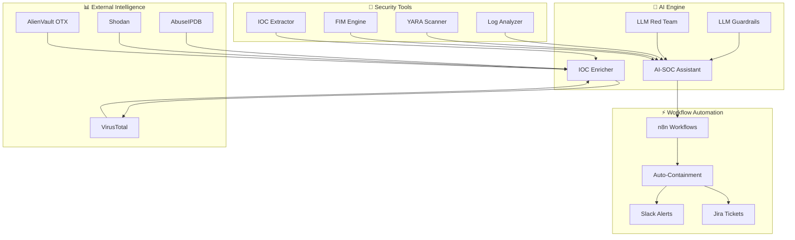

<p align="center">

</p>

<p align="center">
<div align="center">

<h3>
Cyber Defense Architect • Security Engineer • Web3 Builder
</h3>

# 🤖 AI-Powered Security Automation

**Intelligent Automation Framework for Next-Generation Security Operations**

[](https://github.com/kongali1720/Security-Automation-Scripts)
[](https://github.com/kongali1720/Security-Automation-Scripts)
[](https://github.com/kongali1720/Security-Automation-Scripts/issues)
[](LICENSE)
[](https://www.python.org/)
[](https://groq.com/)
[](https://streamlit.io/)


</div>

---

## 📖 Overview

**AI-Powered Security Automation** adalah framework otomatisasi keamanan generasi terbaru yang mengintegrasikan **Large Language Models (LLM)** dan **Machine Learning** ke dalam operasional Security Operations Center (SOC), Blue Team, dan Incident Response.

Framework ini menggabungkan kekuatan **AI Agent**, **Autonomous Workflows**, dan **Traditional Security Tools** untuk menciptakan solusi keamanan yang:

- 🧠 **Cerdas** - Mampu memahami konteks ancaman dan membuat keputusan otonom
- ⚡ **Cepat** - Mengurangi waktu respon dari jam menjadi menit
- 🔄 **Adaptif** - Belajar dari pola serangan dan meningkatkan deteksi
- 🎯 **Presisi** - Mengurangi false positive melalui kontekstualisasi AI

---

# Security Automation Scripts: AI-Driven Defense & Incident Response Framework

[](https://github.com/kongali1720/Security-Automation-Scripts)
[](https://github.com/kongali1720/Security-Automation-Scripts)
[](LICENSE)

An advanced collection of defensive security engineering artifacts, security automation pipelines, and Artificial Intelligence (AI) security guardrails designed to augment modern Security Operations Centers (SOC) and automate complex Incident Response workflows.

---

## 📁 Repository Architecture

The project maintains a modular structural design to separate configuration layers from core functional intelligence:

```text
.
├── .env.example                # Template for secure environment variables
├── requirements.txt            # Core production dependencies
├── requirements-dev.txt        # Development, testing, and linting suites
├── docs/                       # Comprehensive documentation and research papers
├── tests/                      # Unit testing and validation suites
└── config/
    ├── defend.yaml             # Rule definitions for AI security guardrails
    └── settings.yaml           # Global system and API parameters
└── python/
    └── ai/
        ├── __init__.py
        ├── ai_soc_assistant.py # Contextual LLM assistant tailored for SOC operations
        ├── ai_ioc_enricher.py  # Automated threat intelligence ingestion pipeline
        ├── llm_guardrails.py   # Validation layer against prompt injection/data leakage
        └── llm_redteam.py      # Automated adversarial resilience evaluation
```

## 🎯 Key Capabilities

### 🤖 AI-Powered Features

| Feature | Description | Technology |
|----------|-------------|------------|
| 🤖 **AI-SOC Assistant** | AI-powered assistant for log analysis, incident triage, MITRE ATT&CK mapping, and response recommendations. | Groq API • Qwen-32B |
| 🛡️ **LLM Security Guardrails** | Protects LLM applications against prompt injection, jailbreak attempts, sensitive data leakage, and unsafe outputs. | PyDefend |
| 🔴 **LLM Red Teaming** | Automated security assessment framework for evaluating LLM resilience against more than 40 attack scenarios. | DeepTeam Framework |
| 🔍 **AI IOC Enricher** | Enriches Indicators of Compromise (IOCs) with contextual threat intelligence from multiple external sources. | Gemini API • VirusTotal |
| ⚡ **Autonomous Incident Response** | AI-driven orchestration that automates investigation, enrichment, containment, and response workflows. | n8n • AI Agent |

---

### 🛡️ Traditional Security Features

| Category | Components | Purpose |
|----------|------------|---------|
| 📊 **Log Analysis** | Log Analyzer, Log Parser | Parse, normalize, and analyze security logs for SOC investigations. |
| 🎯 **Threat Detection** | YARA Scanner, IOC Extractor | Detect malware, extract IOCs, and support threat intelligence operations. |
| 🔒 **Integrity Monitoring** | File Integrity Monitor (FIM) | Detect unauthorized file modifications using baseline hashing and integrity checks. |
| 🔐 **System Hardening** | System Audit, SSH Hardening | Assess and improve system security based on security best practices and CIS benchmarks. |
| 📄 **Reporting** | Report Generator | Generate comprehensive HTML and PDF security assessment reports. |

---

### Security-Automation-Scripts/

```text
├── python/
│   ├── ai/
│   │   ├── ai_soc_assistant.py     # 🤖 AI-SOC Assistant
│   │   ├── ai_ioc_enricher.py      # 🔍 AI IOC Enricher
│   │   └── __init__.py
│   ├── log_analyzer.py             # 📊 Log Analysis
│   ├── log_parser.py               # 📝 Log Parser
│   ├── ioc_extractor.py            # 🎯 IOC Extractor
│   ├── yara_scanner.py             # 🛡️ YARA Scanner
│   ├── file_integrity_monitor.py   # 🔒 FIM Engine
│   ├── report_generator.py         # 📋 Report Generator
│   ├── llm_guardrails.py           # 🛡️ LLM Guardrails
│   ├── llm_redteam.py              # 🔓 LLM Red Team
│   └── __init__.py
│
├── bash/
│   ├── system_audit.sh             # 🐧 System Audit
│   ├── ssh_hardening.sh            # 🔐 SSH Hardening
│   └── user_audit.sh               # 👤 User Audit
│
├── powershell/
│   ├── eventlog_parser.ps1         # 🪟 Event Log Parser
│   └── windows_audit.ps1           # 🪟 Windows Audit
│
├── workflows/
│   ├── incident_response.json      # ⚡ n8n Workflow
│   └── threat_intel_pipeline.json  # 🔍 n8n Workflow
│
├── config/
│   └── defend.yaml                 # ⚙️ PyDefend Config
│
├── tests/
│   ├── test_ai_soc_assistant.py
│   ├── test_ioc_extractor.py
│   └── test_yara_scanner.py
│
├── .env.example                    # 🔑 API Keys Template
├── .gitignore                      # 📄 Git Ignore
├── requirements.txt               # 📦 Python Dependencies
├── requirements-dev.txt           # 📦 Dev Dependencies
├── LICENSE                        # 📜 MIT License
└── README.md                      # 📖 This File
```

---

## 🏗️ Architecture



## 🚀 Quick Start

```bash
git clone https://github.com/kongali1720/Security-Automation-Scripts.git

cd Security-Automation-Scripts

pip install -r requirements.txt

cp .env.example .env
```

---

## 💻 Example
## AI SOC Assistant

```bash
python python/ai/ai_soc_assistant.py \
    --analyze logs/auth.log \
    --mitre
```

## IOC Enrichment

```bash
python python/ai/ai_ioc_enricher.py \
    --input iocs.json \
    --output enriched.json
```

## Linux Audit
```bash
sudo ./bash/system_audit.sh
```

## Windows Audit
```bash
.\powershell\windows_audit.ps1 -Detailed
```

---

## 🚀 AI Security Roadmap (2026)

The following roadmap outlines the planned evolution of the AI-powered security ecosystem. Features are prioritized to enhance SOC automation, AI security, and autonomous cyber defense capabilities.

| Status | Initiative | Description |
|:------:|------------|-------------|
| ✅ | **AI SOC Assistant** | Intelligent assistant for incident triage, log analysis, and MITRE ATT&CK mapping. |
| ✅ | **Security Copilot** | AI-powered security assistant for investigation, recommendations, and SOC workflows. |
| ✅ | **AI Threat Correlation** | Correlate logs, alerts, and threat intelligence using AI-driven contextual analysis. |
| 🚧 | **MCP Server Security** | Security assessment and hardening toolkit for Model Context Protocol (MCP) servers. |
| 🚧 | **Autonomous Pentesting** | AI-assisted offensive security workflows for automated security validation. |
| 🚧 | **Advanced LLM Guardrails** | Enhanced protection against prompt injection, jailbreaks, and sensitive data leakage. |
| ⬜ | **Multi-Agent SOC** | Collaborative AI agents for autonomous detection, investigation, and response. |
| ⬜ | **AI Incident Commander** | AI-driven orchestration engine for end-to-end incident response automation. |

---

```text
AI-Powered Security Automation

├── ✅ Core AI Engine
│   ├── AI-SOC Assistant
│   ├── LLM Guardrails
│   ├── LLM Red Teaming
│   └── IOC Enricher
│
├── ✅ Traditional Security Tools
│   ├── Log Analysis
│   ├── YARA Scanning
│   ├── FIM
│   └── System Hardening
│
├── 🚧 Advanced AI Features
│   ├── Agent Skills Framework
│   ├── MCP Server Scanner
│   ├── Autonomous Pentesting
│   └── Self-Healing Security
│
├── 📅 Integration & Automation
│   ├── SIEM Integration (Splunk, ELK)
│   ├── SOAR Integration
│   ├── n8n Workflows
│   └── GitHub Actions CI/CD
│
└── 📅 User Interface
    ├── Streamlit Dashboard
    ├── Grafana Monitoring
    └── Slack/Teams Integration
```

```bash
# Analyze log and get AI recommendations
python python/ai/ai_soc_assistant.py --analyze /var/log/auth.log

# Output:
# 📊 Incident Summary:
# - 45 failed login attempts from 192.168.1.100
# - Pattern indicates brute force attack
# - MITRE ATT&CK: T1110 (Brute Force)
# 
# 🎯 Recommended Playbook:
# 1. Block source IP
# 2. Enable MFA for affected accounts
# 3. Investigate for successful compromises
```

```bash
# Run AI-powered incident response workflow
python python/ai/ai_soc_assistant.py --workflow incident_response --alert alert.json

# Workflow Steps:
# ✅ Alert Received
# ✅ Threat Enrichment (VT, AbuseIPDB)
# ✅ AI Severity Assessment (Critical)
# ✅ Auto-Containment Executed
# ✅ Slack Alert Sent
# ✅ Jira Ticket Created
```

```bash
# Hunt for threats using AI correlation
python python/ai/ai_soc_assistant.py --hunt --timeframe 24h --output threat_report.json

# Features:
# - Correlate events across multiple sources
# - Identify attack chains
# - Generate threat hunting hypotheses
# - Provide actionable recommendations
```

## 🔐 Security Considerations

> [!WARNING]
> This repository is intended **exclusively for defensive security, cybersecurity research, educational purposes, and authorized security assessments**.
>
> **Never execute any script or security assessment against systems, applications, or networks without explicit authorization from the owner.**

### Security Best Practices

| Topic | Recommendation |
|--------|----------------|
| 🔑 **API Keys & Secrets** | Never commit credentials or API keys to Git. Store sensitive configuration securely using a `.env` file or a secrets manager. |
| 🔒 **Sensitive Data** | Execute security tools only within trusted, isolated, and properly secured environments. |
| 🤖 **AI Models** | Ensure compliance with privacy regulations and organizational policies when using cloud-based AI services. |
| 🔴 **Red Teaming** | Perform LLM security assessments only against systems you own or are explicitly authorized to test. |
| 📄 **Log Files** | Security logs may contain Personally Identifiable Information (PII). Always sanitize sensitive information before sharing or publishing. |
| 📦 **Dependencies** | Regularly update Python packages, system dependencies, and third-party tools to mitigate known vulnerabilities. |

---

## 🎯 Technical Focus

This project focuses on building practical, AI-assisted cybersecurity solutions for modern Security Operations Centers (SOC), incident response, and defensive security engineering.

| Domain | Specialization |
|--------|----------------|
| 🔵 **Blue Team Engineering** | Detection Engineering, SOC Operations, Detection Rules |
| 🔴 **Incident Response** | Digital Forensics, Incident Triage, Automated Containment |
| 🛡️ **Security Automation** | Cross-platform Automation using Python, Bash, and PowerShell |
| 🤖 **AI Security** | LLM Security, Prompt Injection Defense, AI Guardrails, AI SOC |
| 🔍 **Threat Hunting** | IOC Correlation, Threat Intelligence, Behavioral Analysis |
| 📊 **Security Operations Center (SOC)** | SIEM Optimization, Log Correlation, Threat Monitoring |
| 🌐 **Web3 Security** | Smart Contract Security, Blockchain Forensics, Wallet Investigation |

---

## 🙏 Acknowledgments

This project is built upon the incredible work of the open-source cybersecurity and AI communities.

### 🤖 AI & Inference

- 🚀 Groq
- 🤖 OpenAI
- 💎 Google Gemini

### ⚙️ Automation & Orchestration

- 🎨 Streamlit
- ⚡ n8n
- 🐙 GitHub Actions

### 🛡️ Threat Intelligence & Detection

- 🌍 VirusTotal
- 🚨 AbuseIPDB
- 🛡️ YARA
- 📐 Sigma Rules
- 🎯 MITRE ATT&CK

### ❤️ Open Source Community

Special thanks to all researchers, maintainers, contributors, and the global open-source cybersecurity community whose work continues to inspire and advance defensive security.


---
<div align="center">

## ☕ Support the Project

If this project has helped your research, learning, or security operations, consider supporting its continued development.

<div align="center">

<a href="https://www.paypal.com/paypalme/bungtempong99">

</a>

</div>

---


