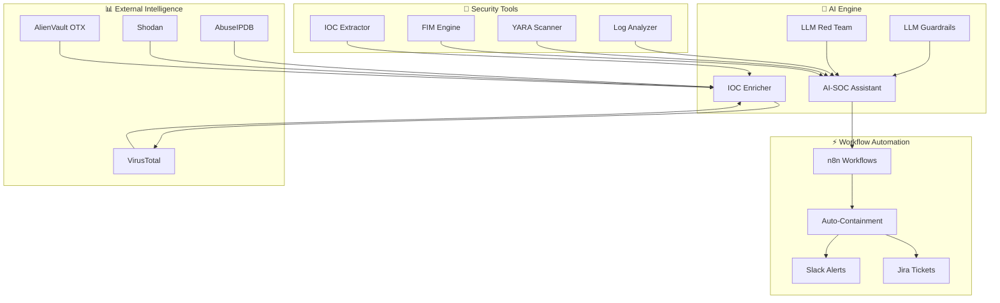

<p align="center">

</p>

<p align="center">

<div align="center">

<h3>
Cyber Defense Architect • Security Engineer • Web3 Builder
</h3>

# 🤖 AI-Powered Security Automation

**Intelligent Automation Framework for Next-Generation Security Operations**

[](https://github.com/kongali1720/Security-Automation-Scripts)
[](https://github.com/kongali1720/Security-Automation-Scripts)
[](https://github.com/kongali1720/Security-Automation-Scripts/issues)
[](LICENSE)
[](https://www.python.org/)
[](https://groq.com/)
[](https://streamlit.io/)


</div>

---

## 📖 Overview

**AI-Powered Security Automation** adalah framework otomatisasi keamanan generasi terbaru yang mengintegrasikan **Large Language Models (LLM)** dan **Machine Learning** ke dalam operasional Security Operations Center (SOC), Blue Team, dan Incident Response.

Framework ini menggabungkan kekuatan **AI Agent**, **Autonomous Workflows**, dan **Traditional Security Tools** untuk menciptakan solusi keamanan yang:

- 🧠 **Cerdas** - Mampu memahami konteks ancaman dan membuat keputusan otonom
- ⚡ **Cepat** - Mengurangi waktu respon dari jam menjadi menit
- 🔄 **Adaptif** - Belajar dari pola serangan dan meningkatkan deteksi
- 🎯 **Presisi** - Mengurangi false positive melalui kontekstualisasi AI

---

## 🎯 Key Capabilities

### 🤖 AI-Powered Features

| Capability | Description | Technology |
|------------|-------------|------------|
| **AI-SOC Assistant** | Intelligent assistant for log triage, incident analysis, and playbook recommendation | Groq API + Qwen-32B |
| **LLM Security Guardrails** | Protect LLM applications from prompt injection, PII leakage, and harmful content | PyDefend |
| **LLM Red Teaming** | Penetration testing for LLM systems - detect 40+ vulnerabilities | DeepTeam Framework |
| **AI IOC Enricher** | Auto-enrich Indicators of Compromise with threat intelligence and AI context | Gemini API + VT |
| **Autonomous Incident Response** | End-to-end automated response workflow with AI decision making | n8n + AI Agent |

### 🛡️ Traditional Security Features

| Category | Tools | Purpose |
|----------|-------|---------|
| **Log Analysis** | Log Analyzer, Log Parser | SIEM-style log parsing and analysis |
| **Threat Detection** | YARA Scanner, IOC Extractor | Malware detection and threat intelligence |
| **Integrity Monitoring** | File Integrity Monitor | Baseline hashing and drift detection |
| **System Hardening** | System Audit, SSH Hardening | CIS benchmark compliance |
| **Reporting** | Report Generator | Executive HTML/PDF reports |

---

```text
Security-Automation-Scripts/

├── python/
│   ├── ai/
│   │   ├── ai_soc_assistant.py     # 🤖 AI-SOC Assistant
│   │   ├── ai_ioc_enricher.py      # 🔍 AI IOC Enricher
│   │   └── __init__.py
│   ├── log_analyzer.py             # 📊 Log Analysis
│   ├── log_parser.py               # 📝 Log Parser
│   ├── ioc_extractor.py            # 🎯 IOC Extractor
│   ├── yara_scanner.py             # 🛡️ YARA Scanner
│   ├── file_integrity_monitor.py   # 🔒 FIM Engine
│   ├── report_generator.py         # 📋 Report Generator
│   ├── llm_guardrails.py           # 🛡️ LLM Guardrails
│   ├── llm_redteam.py              # 🔓 LLM Red Team
│   └── __init__.py
│
├── bash/
│   ├── system_audit.sh             # 🐧 System Audit
│   ├── ssh_hardening.sh            # 🔐 SSH Hardening
│   └── user_audit.sh               # 👤 User Audit
│
├── powershell/
│   ├── eventlog_parser.ps1         # 🪟 Event Log Parser
│   └── windows_audit.ps1           # 🪟 Windows Audit
│
├── workflows/
│   ├── incident_response.json      # ⚡ n8n Workflow
│   └── threat_intel_pipeline.json  # 🔍 n8n Workflow
│
├── config/
│   └── defend.yaml                 # ⚙️ PyDefend Config
│
├── tests/
│   ├── test_ai_soc_assistant.py
│   ├── test_ioc_extractor.py
│   └── test_yara_scanner.py
│
├── .env.example                    # 🔑 API Keys Template
├── .gitignore                      # 📄 Git Ignore
├── requirements.txt               # 📦 Python Dependencies
├── requirements-dev.txt           # 📦 Dev Dependencies
├── LICENSE                        # 📜 MIT License
└── README.md                      # 📖 This File
````


## 🏗️ Architecture


# 🤖 AI Security Modules

This project includes AI-powered capabilities designed to enhance Security Operations Center (SOC) workflows, threat hunting, and LLM security assessments.

| Module | Purpose | Technologies |
|---------|---------|--------------|
| 🤖 AI SOC Assistant | AI-assisted incident triage and log analysis | Groq • Qwen • OpenAI |
| 🛡️ LLM Guardrails | Secure LLM interactions and prompt filtering | PyDefend |
| 🔴 LLM Red Team | Security assessment for LLM applications | DeepTeam |
| 🔍 AI IOC Enricher | Threat intelligence enrichment | VirusTotal • AbuseIPDB • Gemini |
| ⚡ n8n Workflows | Automated SOC playbooks | n8n |

> 📚 Detailed documentation for each module is available in the **docs/** directory.

## 🚀 Quick Start

```bash
git clone https://github.com/kongali1720/Security-Automation-Scripts.git

cd Security-Automation-Scripts

pip install -r requirements.txt

cp .env.example .env
```

## 💻 Example

### AI SOC Assistant

```bash
python python/ai/ai_soc_assistant.py \
    --analyze logs/auth.log \
    --mitre
```

### IOC Enrichment

```bash
python python/ai/ai_ioc_enricher.py \
    --input iocs.json \
    --output enriched.json
```

### Linux Audit

```bash
sudo ./bash/system_audit.sh
```

### Windows Audit

```powershell
.\powershell\windows_audit.ps1 -Detailed
```

## 🚀 AI Security Roadmap (2026)

| Status | Feature |
|:------:|---------|
| ✅ | AI SOC Assistant |
| ✅ | Security Copilot |
| ✅ | AI Threat Correlation |
| 🚧 | MCP Server Security |
| 🚧 | Autonomous Pentesting |
| 🚧 | AI Guardrails |
| ⬜ | Multi-Agent SOC |
| ⬜ | AI Incident Commander |

```text
AI-Powered Security Automation

├── ✅ Core AI Engine
│   ├── AI-SOC Assistant
│   ├── LLM Guardrails
│   ├── LLM Red Teaming
│   └── IOC Enricher
│
├── ✅ Traditional Security Tools
│   ├── Log Analysis
│   ├── YARA Scanning
│   ├── FIM
│   └── System Hardening
│
├── 🚧 Advanced AI Features
│   ├── Agent Skills Framework
│   ├── MCP Server Scanner
│   ├── Autonomous Pentesting
│   └── Self-Healing Security
│
├── 📅 Integration & Automation
│   ├── SIEM Integration (Splunk, ELK)
│   ├── SOAR Integration
│   ├── n8n Workflows
│   └── GitHub Actions CI/CD
│
└── 📅 User Interface
    ├── Streamlit Dashboard
    ├── Grafana Monitoring
    └── Slack/Teams Integration
```

```bash
# Analyze log and get AI recommendations
python python/ai/ai_soc_assistant.py --analyze /var/log/auth.log

# Output:
# 📊 Incident Summary:
# - 45 failed login attempts from 192.168.1.100
# - Pattern indicates brute force attack
# - MITRE ATT&CK: T1110 (Brute Force)
# 
# 🎯 Recommended Playbook:
# 1. Block source IP
# 2. Enable MFA for affected accounts
# 3. Investigate for successful compromises
```

```bash
# Run AI-powered incident response workflow
python python/ai/ai_soc_assistant.py --workflow incident_response --alert alert.json

# Workflow Steps:
# ✅ Alert Received
# ✅ Threat Enrichment (VT, AbuseIPDB)
# ✅ AI Severity Assessment (Critical)
# ✅ Auto-Containment Executed
# ✅ Slack Alert Sent
# ✅ Jira Ticket Created
```

```bash
# Hunt for threats using AI correlation
python python/ai/ai_soc_assistant.py --hunt --timeframe 24h --output threat_report.json

# Features:
# - Correlate events across multiple sources
# - Identify attack chains
# - Generate threat hunting hypotheses
# - Provide actionable recommendations
```

---

---

# 🔐 Security Considerations

> [!WARNING]
> This project is intended **only for defensive security, research, education, and authorized security assessments.**
>
> Never execute any script against systems or networks without **explicit authorization**.

### Security Best Practices

| Topic | Recommendation |
|--------|----------------|
| 🔑 API Keys | Never commit secrets to Git. Store credentials in a `.env` file. |
| 🔒 Sensitive Data | Execute scripts only in trusted and secured environments. |
| 🤖 AI Models | Ensure compliance with applicable privacy and data protection regulations when using cloud-based AI services. |
| 🔴 Red Teaming | Perform LLM security assessments only on systems you own or are authorized to test. |
| 📄 Log Files | Logs may contain Personally Identifiable Information (PII). Always sanitize sensitive data before sharing. |
| 📦 Dependencies | Keep Python packages and third-party tools up to date to reduce security risks. |

---

# 📄 License

This project is distributed under the **MIT License**.

See the **LICENSE** file for additional information.

---

# 👨‍💻 Author

<div align="center">

## Kong Ali

**Cybersecurity Enthusiast • Blue Team • Security Automation • AI Security**

[](https://github.com/kongali1720)

</div>

### 🎯 Focus Areas

| Domain | Specialization |
|---------|----------------|
| 🔵 Blue Team Engineering | Detection Engineering, SOC Operations |
| 🔴 Incident Response | Digital Investigation & Containment |
| 🛡️ Security Automation | Python, Bash & PowerShell |
| 🤖 AI Security | LLM Security, AI Guardrails & AI SOC |
| 🔍 Threat Hunting | IOC Correlation & Detection |
| 📊 Security Operations Center | SIEM, Detection & Monitoring |
| 🌐 Web3 Security | Smart Contract & Blockchain Security |

---

# 🙏 Acknowledgments

Special thanks to the following projects and communities:

- 🚀 **Groq** — High-performance LLM inference
- 🤖 **OpenAI** — AI capabilities and language models
- 💎 **Google Gemini** — AI-assisted threat intelligence
- 🎨 **Streamlit** — Interactive web applications
- ⚡ **n8n** — Workflow automation platform
- 🛡️ **YARA** — Malware pattern matching
- 🌍 **VirusTotal** — Threat intelligence platform
- 🚨 **AbuseIPDB** — IP reputation services
- ❤️ **Open Source Community** — Continuous inspiration and collaboration

---

# 📊 Repository Statistics

<div align="center">


</div>

---

# ❤️ Support the Project

If this project helps you, please consider supporting its development.

<div align="center">

### ⭐ Star this Repository

If you find this project useful, please leave a **Star** to support future development.

<a href="https://github.com/kongali1720/Security-Automation-Scripts">

</a>

<br><br>

### ☕ Buy Me a Coffee

<a href="https://www.paypal.com/paypalme/bungtempong99">

</a>

</div>

---

# 📁 Project Structure

The following supporting files are recommended:

```text
.env.example
requirements.txt
requirements-dev.txt

docs/

tests/

config/
├── defend.yaml
└── settings.yaml

python/
└── ai/
    ├── __init__.py
    ├── ai_soc_assistant.py
    ├── ai_ioc_enricher.py
    ├── llm_guardrails.py
    └── llm_redteam.py
```

---

# 🚀 Future Enhancements

- 🎥 Interactive GIF demonstrations
- 📺 Video tutorials
- 📊 Streamlit Dashboard
- 🛡️ AI Security Dashboard
- 📈 Real-time Threat Intelligence
- 🤖 Multi-Agent Security Operations
- ⚡ AI Copilot for SOC Analysts
- 🌐 Web-based Management Console
- ☁️ Docker & Kubernetes Deployment
- 🔄 GitHub Actions CI/CD Pipeline

---

<div align="center">

## 🛡️ Secure • Detect • Automate • Respond

**Built with ❤️ for the Open Source Cybersecurity Community**

**⭐ Star • 🍴 Fork • 🤝 Contribute • 🚀 Secure Together**

</div>


